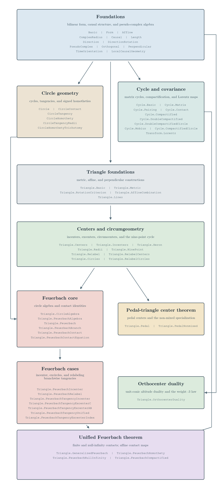
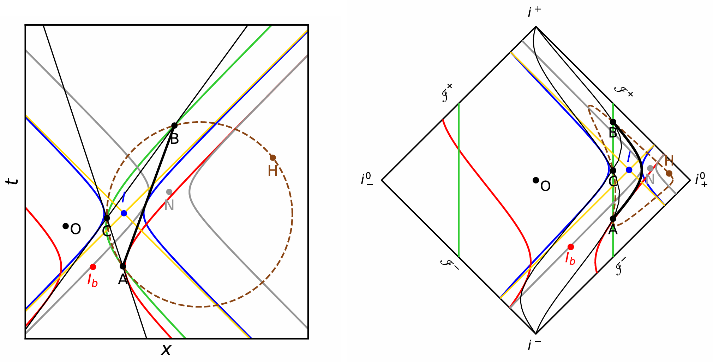

# MinkowskiMerge

Lean formalization of theorems from the paper "Feuerbach contacts and orthocenter geometry in the Minkowski plane".

### Build

The code uses Lean `4.28.0`, as specified in `lean-toolchain`; the exact Mathlib revision is recorded in `lake-manifest.json`.

From the repository root, run:

```powershell
lake build MinkowskiMerge
```

### Code hierarchy

(see [MinkowskiMerge Lean dependency graph](https://fubinyan.github.io/MinkowskiMerge-DependencyGraph/) for a more detailed version)

<p align="center">
  
</p>

### Example

<p align="center">
  
</p>

A timelike non-mixed triangle in the Minkowski diagram (left) and the corresponding Penrose diagram (right). The solid blue, red, gray, and green curves represent, respectively, the incircle centered at $I$, the excircle centered at $I_b$, the nine-point circle centered at $N$, and the circumcircle centered at $O$. The yellow lines are the null lines through $I$. The brown point is the Minkowski orthocenter $H$, and the dashed brown curve is the Euclidean circumcircle. In Penrose coordinates centered at $O$, the unit Minkowski circumcircle is mapped to the two straight lines. The thick black side marks the unique side associated with negative $\lambda$-value. Placing vertices on different components of the circumcircle instead produces a mixed triangle.
